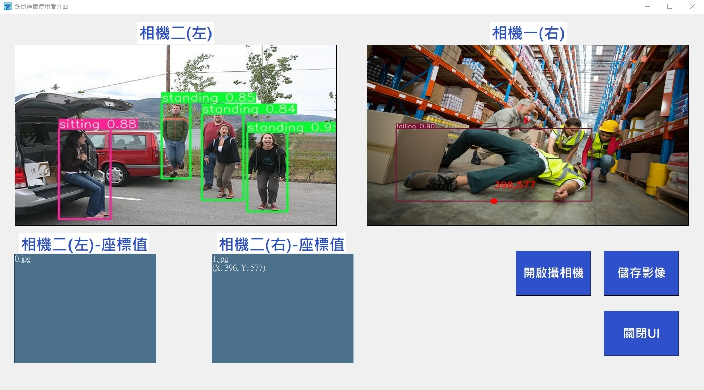

##  [Fall Detection GUI with YOLOv5 Python]
---

### Introduction
* Class: standing, sitting, falling.
* Train set: 715 images
* Validation set: 377 images

### Dependencies and Installation
* python=3.6.10
* PyTorch=1.7.1
* NVIDIA GPU=GTX1660Ti + CUDA=10.2
* numpy=1.19.5
* matplotlib=3.3.4
* pillow=8.4.0
* opencv-python=3.3.0.9

### Preparation
Prepare two cameras and Trained YOLOv5 weights.

 FILE STRUCTURE 

    
    Fall Detection UI with YOLOv5 (Python)
    |-- README.md
    |-- api
        |-- camera.py
    |-- Detection results
        |-- 0.jpg
        |-- 1.jpg
    |-- Photographed images
        |-- 0.jpg
        |-- 1.jpg
    |-- YOLOv5
        |-- models
        |-- runs
            |-- train
                |-- 7_496124
                    |-- weights
                        |-- best.pt
                        |-- last.pt
        |-- utils
        |-- detect.py
        
    |-- front.ico
    |-- UI.py
    

### Metrics update
|Methods|Precision|Recall|mAP(0.5)|mAP(0.5:0.95)
|-|-|-|-|-|
|YOLOv5m|0.8039|0.8259|0.8462|0.6068|

### UI
#### Samples

 

